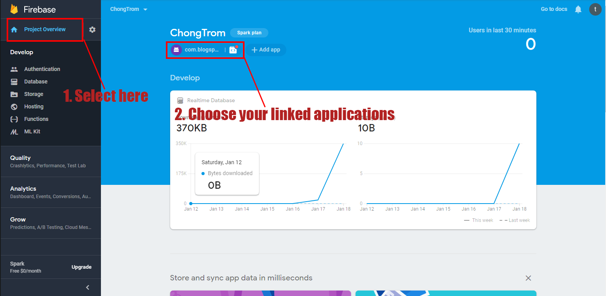

# AntiTheft
[](https://www.facebook.com/tx.trongnghia98)
[](http://developer.android.com/index.html)
[](https://android-arsenal.com/api?level=15)
#### Desgin app theme and demo with:
* Firebase (RealtimeDatabase)
* Services
* Notificaton
* Vibrate and Alert sound when have theft
* Beautiful design,...

## Update log
#### 20/1/2019: Version 1.1.1 logs
```
- Bugs stop application when apply data without internet connection
- Alert for change sate buttons when lost connection
- Change state header of activity and notification of service when internet connection state change
- And add more bugs for fix later,...
```

## Screenshots
### 1. Activity
<p align="center">
	
</p>

### 2. Toaty and Notify
<p align="center">
	
</p>

### 3. Exit
<p align="center">
	
</p>

## Sample project
You can download the latest sample APK from this repo here: [Antitheft.apk](Demo/AntiTheft.apk)

## Getting started
#### 1. Connect to Firebase
You can read [document of google](https://developer.android.com/studio/write/firebase), it has full detail for you setting.

#### 2. Slect your liked applications
<p align="center">
	
</p>

#### 3. Config and do like document to download google-services.json
<p align="center">
	
</p>

#### 3. Replace google-services.json in this projects
<p align="center">
	
</p>

## Designer
#### Name: [Nguyen Trong Nghia](https://www.facebook.com/tx.trongnghia98)
#### Email: projects.futuresky@gmail.com
#### Phone: +84 86 48 3147
#### Blogger: [TNdev1403](https://tndev1403.blogspot.com)